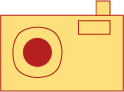

# EvRecorder 🎯

<div align="center">
  
  <br>
  <strong>Cross-browser extension for capturing user interaction events</strong>
</div>

---

## ✨ Features
- 🎯 Real-time event capturing (clicks, scrolls, keystrokes, mouse movements)
- 🔒 URL and keystroke anonymization
- ⚙️ Configurable event types and attributes
- 📊 Session-based data collection
- 📈 Visual status indicators
- 🌐 Cross-browser compatibility (Chrome, Firefox, Edge, Opera)
- 🛡️ Manifest V3 with proper Content Security Policy
- 💾 Automatic data backup every 5 minutes
- 🔄 Recovery on browser restart
- 📝 Standardized logging with prefixes

## 🎨 Extension States

<table align="center">
  <tr>
    <td align="center">
      <br>
      <strong>Inactive</strong><br>
      Not capturing
    </td>
    <td align="center">
      <br>
      <strong>Active</strong><br>
      Capturing events
    </td>
  </tr>
</table>

## 🔧 Configuration

Events are configured through the server response with the following structure:

```json
{
  "timeout": 10000,
  "url": false,
  "events": [
    {
      "type": "click",
      "polling": false,
      "attributes": ["clientX", "clientY"]
    },
    {
      "type": "keydown",
      "polling": false,
      "attributes": ["key", "code"],
      "anonymization": {
        "key": true,
        "code": true
      }
    }
  ]
}
```

### Configuration Options
- **timeout**: ⏱️ Capture duration (milliseconds)
- **url**: 🔒 Enable URL anonymization
- **events**: 📋 Event configurations
  - **type**: 🎯 Event type (`click`, `scroll`, `keydown`, `mousemove`)
  - **polling**: 🔄 Use polling or event listeners
  - **attributes**: 📝 Properties to capture
  - **anonymization**: 🛡️ Attributes to anonymize

## 📊 Captured Data

Session data structure:

```json
{
  "userId": "user-configured-id",
  "tabId": 123,
  "url": "https://example.com",
  "startTime": 1640995200000,
  "endTime": 1640995210000,
  "events": [
    {
      "type": "click",
      "timestamp": 1640995201500,
      "clientX": 150,
      "clientY": 200
    }
  ]
}
```

## 📦 Installation

### Chrome / Edge / Opera
1. 🔧 Enable Developer mode in browser extensions page
   - Chrome: `chrome://extensions/`
   - Edge: `edge://extensions/`
   - Opera: `opera://extensions/`
2. 📁 Click "Load unpacked" and select extension folder
3. ⚙️ **Configure server URL and user ID** (required for capture to work)
4. 🌐 Start browsing to capture events

### Firefox
1. 🔧 Open Firefox and go to `about:debugging`
2. 📁 Click "This Firefox" → "Load Temporary Add-on"
3. 📄 Select the `manifest.json` file
4. ⚙️ **Configure server URL and user ID** (required for capture to work)
5. 🌐 Start browsing to capture events

> **Note**: For Firefox production, the extension needs to be signed by Mozilla. For Chrome Web Store, Edge Add-ons, and Opera Add-ons, upload the same package.

## 🖥️ Server Integration

⚠️ **Server configuration is required** - the extension will not capture events without a configured server.

The extension communicates with a server using two main endpoints:

### Endpoints

#### GET `/start`
- **Purpose**: 🎯 Fetch event configuration when starting capture
- **Response**: JSON configuration object
- **Called**: When extension loads or starts new capture session

#### POST `/save`
- **Purpose**: 💾 Save captured session data
- **Body**: Complete session data including events
- **Called**: When capture session ends (tab closed/navigation)

## 🖥️ Example Server

Use our server implementation: **🔗 [EvRecorder-Server](https://github.com/Keykor/EvRecorder-Server)**

Includes API documentation, examples, and setup instructions.

## ⚡ How It Works

1. 🆔 Configure user ID and server URL in options (both required)
2. 🎯 Extension fetches configuration from server (`GET /start`)
3. 🚀 Extension captures events automatically based on server config
4. 💾 Data sent to server (`POST /save`) when session ends
5. 🎯 Icon shows capture status (inactive/active)
6. 🌐 Works seamlessly across Chrome, Firefox, Edge, and Opera
7. ❌ No capture without server configuration

## 🛡️ Data Protection & Recovery

The extension includes robust data protection mechanisms:

### 💾 Automatic Backup
- 📅 **Every 5 minutes**: Session data automatically saved to local storage
- 🔍 **Data validation**: Only valid sessions are backed up
- 🧹 **Auto-cleanup**: Storage cleared when no active sessions

### 🔄 Recovery System
- 🚀 **On startup**: Extension checks for pending data from previous session
- 📤 **Auto-send**: Pending data automatically sent to server
- ⏰ **Smart timestamps**: Uses last event time for forced closures
- 📊 **Recovery stats**: Logs success/failure counts for monitoring

### 📝 Logging System
- 🏷️ **Prefixed logs**: Easy filtering by functionality
  - `[INIT]` - Extension initialization
  - `[SESSION]` - Session management
  - `[BACKUP]` - Data backup operations
  - `[RECOVERY]` - Data recovery on startup
  - `[CONFIG]` - Server configuration
  - `[SEND]` - Data transmission
  - `[TAB]` - Browser tab events
  - `[DEBUG]` - Debug mode operations

## 🔄 Debug Mode

The extension includes a debug mode that can be toggled from the options page:
- 🐛 **Debug ON**: Shows detailed console logs for troubleshooting
- 🤫 **Debug OFF**: Minimal logging for production use

## 🔒 Anonymization

- 🌐 **URLs**: Can be hidden
- ⌨️ **Keystrokes**: Randomized letters/numbers
- ⚙️ **Configurable**: Per event type