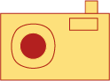

# EvRecorder 🎯

<div align="center">
  
  <br>
  <strong>Browser extension for capturing user interaction events</strong>
</div>

---

## ✨ Features
- 🎯 Real-time event capturing (clicks, scrolls, keystrokes, mouse movements)
- 🔒 URL and keystroke anonymization
- ⚙️ Configurable event types and attributes
- 📊 Session-based data collection
- 📈 Visual status indicators

## 🎨 Extension States

<table align="center">
  <tr>
    <td align="center">
      <br>
      <strong>Inactive</strong><br>
      Not capturing
    </td>
    <td align="center">
      <br>
      <strong>Active</strong><br>
      Capturing events
    </td>
  </tr>
</table>

## 🔧 Configuration

Events are configured through a JSON file with the following structure:

```json
{
  "timeout": 10000,
  "url": false,
  "events": [
    {
      "type": "click",
      "polling": false,
      "attributes": ["clientX", "clientY"]
    },
    {
      "type": "keydown",
      "polling": false,
      "attributes": ["key", "code"],
      "anonymization": {
        "key": true,
        "code": true
      }
    }
  ]
}
```

### Configuration Options
- **timeout**: ⏱️ Capture duration (milliseconds)
- **url**: 🔒 Enable URL anonymization
- **events**: 📋 Event configurations
  - **type**: 🎯 Event type (`click`, `scroll`, `keydown`, `mousemove`)
  - **polling**: 🔄 Use polling or event listeners
  - **attributes**: 📝 Properties to capture
  - **anonymization**: 🛡️ Attributes to anonymize

## 📊 Captured Data

Session data structure:

```json
{
  "userId": "user-configured-id",
  "tabId": 123,
  "url": "https://example.com",
  "startTime": 1640995200000,
  "endTime": 1640995210000,
  "events": [
    {
      "type": "click",
      "timestamp": 1640995201500,
      "clientX": 150,
      "clientY": 200
    }
  ]
}
```

## 📦 Installation

1. 🔧 Enable Developer mode in Chrome (`chrome://extensions/`)
2. 📁 Load unpacked extension
3. ⚙️ Configure server URL and user ID
4. 🌐 Start browsing to capture events

## 🖥️ Example Server

Use our server implementation: **🔗 [EvRecorder-Server](https://github.com/Keykor/EvRecorder-Server)**

Includes API documentation, examples, and setup instructions.

## ⚡ How It Works

1. 🆔 Configure user ID and server URL
2. 🚀 Extension captures events automatically  
3.  Data sent to server when session ends
4. 🎯 Icon shows capture status

## 🔒 Anonymization

- 🌐 **URLs**: Can be hidden
- ⌨️ **Keystrokes**: Randomized letters/numbers
- ⚙️ **Configurable**: Per event type